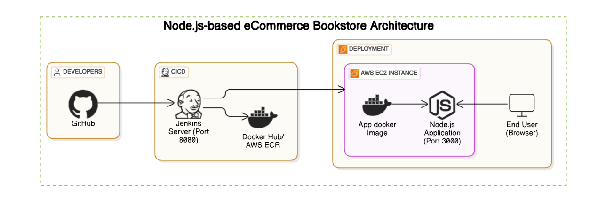

# 📚 Bookstore Web Application

## Table of Contents
1. [Overview](#overview)
2. [Architecture](#architecture)
3. [Prerequisites](#prerequisites)
4. [Setup Instructions](#setup-instructions)
5. [Deployment](#deployment)
6. [CI/CD Pipeline](#ci-cd-pipeline)
7. [License](#license)

---

## Overview

The **Bookstore Web Application** is a modern eCommerce platform built using **React.js** to manage and sell books online. The application is containerized using **Docker**, deployed on **AWS EC2**, and managed through a robust **CI/CD pipeline** powered by **Jenkins**. It provides a seamless user experience with features like book listings, shopping cart functionality, and order management.


---

## Architecture

The application follows a microservices-based architecture, leveraging the following technologies:

- **Frontend**: A React js frontend.
- **Containerization**: Docker for packaging and deploying the application.
- **CI/CD**: Jenkins automates the build, test, and deployment process.
- **Hosting**: AWS EC2 instance for hosting both the application and Jenkins server.

### Workflow Diagram



---


## Prerequisites

Before setting up or contributing to this project, ensure you have the following installed:

- **Node.js** (v14 or higher)
- **npm** (v6 or higher)
- **Docker** (for containerization)
- **Docker Compose** (optional, for local development)
- **AWS CLI** (for interacting with AWS services)
- **Jenkins** (for CI/CD pipeline)
- **Git** (for version control)

---

## Setup Instructions

### Local Development

1. **Clone the Repository**
   ```bash
   git clone https://github.com/yourusername/bookstore-webapp.git
   cd bookstore-webapp
   ```

2. **Install Dependencies**
   ```bash
   npm install
   ```

3. **Start the Application**
   ```bash
   npm start
   ```
   The application will run on `http://localhost:3000`.

4. **Run Tests**
   ```bash
   npm test
   ```

### Docker Setup

1. Build the Docker image:
   ```bash
   docker build -t bookstore-app .
   ```

2. Run the Docker container:
   ```bash
   docker run -p 3000:3000 bookstore-app
   ```

---

## Deployment

The application is deployed on an **AWS EC2 instance**. Here's how it works:

1. The source code is pushed to **GitHub**.
2. **Jenkins** pulls the latest code and triggers the CI/CD pipeline.
3. Jenkins builds a Docker image and pushes it to **Docker Hub** or **AWS Elastic Container Registry (ECR)**.
4. Jenkins deploys the containerized application on the EC2 instance.
5. **Nginx** acts as a reverse proxy to manage incoming traffic.

---

## CI/CD Pipeline

The CI/CD pipeline is managed using **Jenkins** and consists of the following stages:

1. **Code Pull**: Jenkins pulls the latest code from the repository.
2. **Build**: Jenkins builds the Docker image.
3. **Test**: Automated tests are executed to ensure code quality.
4. **Push**: The Docker image is pushed to Docker Hub/AWS ECR.
5. **Deploy**: Jenkins deploys the containerized application on the AWS EC2 instance.

---

## License

This project is licensed under the **MIT License**. See the [LICENSE](LICENSE) file for details.
